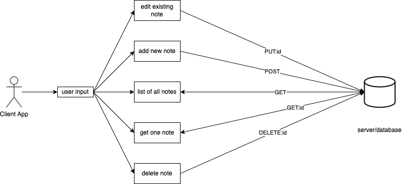

# Notes App - better name pending

A simple, clean note taking app for the web.

## UML

## Getting Started

To copy the project, clone the repo down using the big green CODE button. Once cloned, run either `yarn` or `npm init` in your terminal, whichever flavor you prefer.

### Prerequisites

  - A computer with the latest install of Node.js
  - A package manager. Either [Yarn](https://classic.yarnpkg.com/en/) or [NPM](https://docs.npmjs.com/downloading-and-installing-node-js-and-npm). Personally, I like `Yarn`

## Built With

  - [Creative Commons](https://creativecommons.org/) - Used to choose
    the license

<!-- ## Contributing

Please read [CONTRIBUTING.md](CONTRIBUTING.md) for details on our code
of conduct, and the process for submitting pull requests to us. -->

<!-- ## Versioning

We use [Semantic Versioning](http://semver.org/) for versioning. -->

## Authors

  [Penjoe](https://github.com/penjoe)

## License

This project is licensed under the [Attribution-ShareAlike 4.0 International](LICENSE.md)
Creative Commons License - see the [LICENSE.md](LICENSE.md) file for
details
